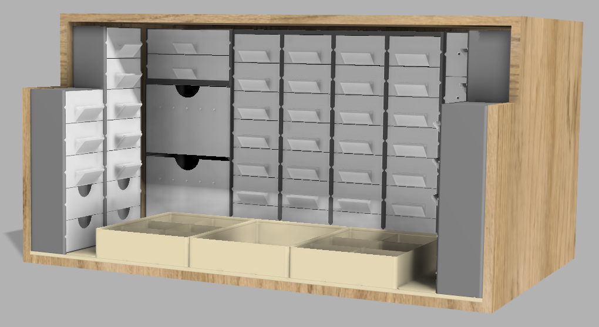

# GridfinityPlus

An [Autodesk Fusion](https://www.autodesk.com/products/fusion-360) add-in for generating [Gridfinity](https://gridfinity.xyz/) baseplates and bins. It is a fork of
[FusionGridfinityGenerator](https://github.com/Le0Michine/FusionGridfinityGenerator) by **Lev Mishin**, extended with a
grid-aware workflow: plates you can place anywhere and cut to exact sizes, bins that snap onto them, and everything
editable after the fact.

*Example: cabinets with drawers and Gridfinity bins, all made with this add-in.*

> [!WARNING]
> **This fork is vibe-coded.** All changes on top of the original add-in were written by an AI assistant (Claude)
> in a conversational "describe it, try it in Fusion, describe what's wrong" loop. Every feature was tried in Fusion,
> but there are no automated tests, the code has not had a thorough human review, and edge cases will exist.
> Use it at your own risk, double-check the geometry before you print, and keep backups of designs that matter.

## What's different from the original

### Baseplates

- **Editable afterwards.** A baseplate is a single custom feature in the timeline. Double-click it to change any
  setting (size, type, magnets, placement, …) and the plate is rebuilt in place.
- **Two ways to size a plate** (`Size by`):
  - **Cells**: columns × rows. Per edge (left / right / front / back) choose *Flush*, *Border* (solid rim, width you
    set) or *Partial cell* (an extra cell cut to the size you set).
  - **Exact size**: total width × depth in mm. Whole cells are placed first; the leftover goes to the edges you
    marked as *Border* or *Partial cell*, split evenly. Great for filling a drawer edge to edge.
  - A side is always either border or partial cell, never both.
- **Placement**: pick a planar face or construction plane and the plate is centred on it. Optionally pick your own
  anchor point (centre or corner), rotate in 90° steps and offset along X / Y / Z of the chosen plane.
- **Split for printing**: plates bigger than the print bed are cut into tiles (max tile width × depth). Seams run
  between cells, tiles are as even as possible. Optional vertical dovetails (one per cell along each seam): push the
  tiles together from the top. Seam gap (tile to tile) and dovetail clearance are set separately. Every tile is its own body (`… - tile 1/6`), assembled in place — export each body
  for printing.
- **Fast live preview** that updates while you type.
- **Works in Part Design documents** (single-component designs), including several plates in one part.

### Bins

- **Snap to a baseplate.** Click a cell in the viewport: the plate, cabinet top or bin under the cursor is picked
  like a body, together with the cell. Ctrl + click rotates by 90°. Column and row can also be typed in.
- **Stack bins.** Every bin with a stacking lip is a plate for further bins (older bins too): click its top to put
  a bin on it. Bins on top move along when the bin (or cabinet) below is edited.
- **Fill to edge.** Per bin side: *Auto* / *Yes* / *No*. With *Auto*, a bin sitting at the plate edge grows over the
  plate's border or partial cell. Over a partial cell it also gets a matching cut foot, so it seats in the cut pocket.
- **Height in units or in mm** (`Height by`). Units are whole Gridfinity height units (7 mm by default); *Total
  height* takes any height in mm. The height unit itself can be changed too (e.g. 5 mm), as long as at least 1 mm of
  bin body is left above the feet.
- **Editable afterwards** as a custom feature, like plates.
- **Better preview** for hollow (shows compartments / dividers) and shelled bins. Compartment settings only show up for
  hollow bins, where they actually apply.

### Tool cutout (new command, *Modify* panel)

Select a bin and one or more tool bodies (e.g. a screwdriver model). The add-in cuts a cavity you can insert the
tool into **from the top**: it adds a fit tolerance and clears everything above the tool, so no undercut can trap
it. The cutout is stored with the bin and re-applied when you edit the bin.

Known limitation: openings that point downward (e.g. a hollow nozzle tip) can leave a thin pin in the cavity.

### Box system: cabinets, drawers, boxes (new commands, *Create* panel)

**Gridfinity+ Cabinet**: a tall, open-front housing.

- Width / depth in grid units, height in height units or total mm.
- Optional Gridfinity feet (magnet / screw holes): snaps onto a baseplate like a bin.
- Optional Gridfinity grid on top: bins and further cabinets snap onto it, so cabinets stack into a wall. To stack,
  just click the top of an existing cabinet while placing a new one.
- **Slide-in top** (default): the top is a plate of its own that slides in from the front on undercut rails along the
  side walls and stops at the back. The cabinet prints standing with nothing to bridge (feet on the bed), the plate
  prints flat with its grid pockets facing up. *Fixed* keeps the one-piece top. Flat and grid plates are equally
  thick, so cabinets of the same height match outside and inside, whatever their top.
- Columns (vertical dividers) and rows (equal, or weighted like `1,1,2`).
- Guides: **ledges** (inserts rest on shelf strips) or **grooves** (V-grooves, inserts carry runners; an insert can
  span several rows).
- Optional click detent (bump 0.8 mm by default, adjustable), adjustable walls (1.2 mm default) and insert
  clearances.
- Wall mount: screw holes in the back wall for M2–M6, countersunk or pan / cheese head, 1–2 rows, 1–6 holes per row,
  distances from the sides / top / bottom. The back wall gets just thick enough for the head to sit flush inside, so
  the drawers still close (they get a little shorter).
- Editing a cabinet rebuilds its inserts and the cabinets stacked on it.
- Fills to edge over a plate's border / partial cells like bins. The top grid then repeats the partial cell (or stays
  flat), so bins on top can fill to the edge as well.

**Gridfinity+ Drawer**: an insert, sized automatically from the cabinet slot.

- Type: drawer, or blank cover (front + short frame, closes a slot with little filament). Optional shorter depth.
- Front: flush with the cabinet (default) or overlay.
- Handles, all printable without supports:
  - *Recessed pull*: hollow pocket behind the front, flush.
  - *Pull handle*: hollow grip standing out, open at the bottom. Grip face, thicknesses and side walls are adjustable,
    from a thin lip that just sticks out a little to a scoop or D-handle.
  - *Grooved ledge*: closed wedge with a finger groove on top. Set groove width / depth, rim and height; the height
    sets the slope underneath (higher = steeper = easier to print, 0 = 45°).
  - *Top notch*, *finger hole*, *knob* (round, mushroom or spool with a U groove; on a stand, on thin breakaway fins
    or without support).
  - Position top / centre / bottom for protruding handles.
- Label: sticker recess (flush) or card holder on a 3 x 3 grid (top / middle / bottom x left / center / right) plus
  an X / Z offset. *Auto* puts it below or beside the handle, or centres it when there is no handle.
- Wire outlets: holes beside the handle.
- Interior: empty, compartments, a Gridfinity grid for bins, or **spools** for wire: spools side by side on an axle
  across the drawer (axle is a separate body, printed lying flat, with collars), cradles with an open-top slot, an
  eyelet per spool and a wire outlet in front of each spool. Adjustable: side play per spool, divider and end support
  thickness, axle mount (open U or snap-in), outlet height (bottom / axle / top of the spool) with an offset and its
  diameter, axle collar and end play, fillet where the cradles meet the floor. The axle comes in two halves joined by
  a bayonet in the middle (push together, turn a quarter): each half prints standing on its collar, no overhang.
  *Bayonet, smooth outside* keeps the slots inside, so the axle is smooth; *One piece* has one collar and its other
  end runs on towards the side wall (adjustable length) so it can't slide out. Spools are centred in the drawer; every spool is checked
  against the finished drawer (handle, guides, walls) and the dialog says which one does not fit. The preview always
  shows the spools; *Show spools in model* also adds them as a separate body for planning (not for printing).
- Detent: the cabinet's bump is a tooth with a flat ramp in front and a steep edge behind. The insert slides in over
  ramps (also at its back end when it is put in) and a steep flank holds it shut, also with the cabinet tilted
  forward; both insert angles adjustable.
- **Experimental**, off by default: snap tongue. A spring tongue in each side wall of the insert clicks into a catch
  in the cabinet wall when it is closed. Not print-tested yet: the hook and the catches have overhangs that may not
  print cleanly, and the tongue leaves open slots in the insert's side walls (small parts can get stuck there). Turn
  on *Snap catches* on the cabinet and *Snap tongue* on the insert to try it.
- Pull-out stop: *hard* (vertical face, lift the insert a little to take it out; default with ledges), *like the
  detent* (pull firmly; default with grooves) or off. *Show pulled out* moves the insert out for viewing.
- Click a cabinet's front: that picks the cabinet (like selecting a body) and the slot in one go. Or fill a whole
  column or the whole cabinet at once, or use *Picked slots*: every click on the front adds or removes a slot.

All overhangs are 45° (ledges, grooves, runners, rails, handle undersides, teardrop knob). Print cabinets standing
(with the slide-in top; a one-piece top needs supports under it or printing on the back), top plates flat, inserts
bottom down.

**Gridfinity+ Cover**: a flat plate on Gridfinity feet that closes empty baseplate cells, e.g. in front of a
cabinet. Size in cells, thickness above the plate, optional magnet / screw holes. Placed like a bin (click a cell,
Ctrl+Click rotates) and fills to the plate edge over a border or partial cell. Default thickness 1 mm, so the bottom
drawer of a cabinet still slides out over it.

**Copy / paste settings**: right-click a bin, baseplate, cabinet, drawer or cover and choose *Copy Gridfinity+
settings*. Then right-click another one of the same kind and choose *Paste Gridfinity+ settings*: its edit dialog
opens with the copied values (the position stays), OK applies them. With several selected, the settings are applied
to all of them at once (one undo step). New ones of that kind also start with the copied settings.

**Editing in Part designs**: Fusion offers no *Edit Feature* / timeline double-click for add-in features in designs
with design intent *Part*. Right-click the bin, plate, cabinet, drawer or cover (body or browser entry) and use
**Edit Gridfinity+ …** instead.

### Other

- **Clearer UI**: dialogs regrouped and renamed (Size, Placement, Grid unit, Style, Advanced; Width/Depth instead of
  X/Y). Bin columns/rows are 1-based.
- **Result group** in the cabinet and drawer dialogs: key / value lines (outside, inside, spool play, …) and the
  problems in red.
- **Debug log**: the add-in writes `gridfinityplus.log` into its own folder. Handy for bug reports; safe to delete.

## Installation

1. Download `GridfinityPlus-<version>.zip` from the latest
   [release](https://github.com/holomekc/GridfinityPlus/releases/latest) and unzip it. You get a folder named
   **`GridfinityPlus`**; keep that name, Fusion requires it to match `GridfinityPlus.py`.
2. In Fusion: **Utilities → Add-Ins → Scripts and Add-Ins** (Shift + S) → **+** → *Script or add-in from device* →
   select the `GridfinityPlus` folder.
3. Select **GridfinityPlus** in the list and click **Run**. Tick *Run on Startup* if you like.

The commands appear in **Solid → Create** (*Gridfinity+ Baseplate*, *Gridfinity+ Bin*, *Gridfinity+ Cabinet*,
*Gridfinity+ Drawer*, *Gridfinity+ Cover*) and **Solid → Modify** (*Gridfinity+ Tool Cutout*).

GridfinityPlus uses its own command IDs, so it can be installed side by side with the original Gridfinity
Generator from the Autodesk App Store. Its buttons look almost the same ("Gridfinity bin" / "Gridfinity baseplate"),
but what it creates can't be edited or snapped to a grid; use the *Gridfinity+* buttons, or disable the original.

## Typical workflow

1. **Baseplate**: choose *Size by*, set the edges, pick a face to place it on and click OK.
2. **Bin**: choose the plate under *Placement*, click a cell, set size, height and type, then click OK.
3. **Cabinet** (optional): place it on the plate like a bin, set rows / columns and guides. Then run
   **Gridfinity+ Drawer** and click a slot in the cabinet front. **Gridfinity+ Cover** closes empty cells in front.
4. Need changes? Double-click the plate, bin or cabinet in the timeline (Part designs: right-click → *Edit
   Gridfinity+ …*).
5. Optional: model a tool, then run **Gridfinity+ Tool Cutout** on a bin.

## Compatibility notes

- Plates and bins made with older versions of this fork open as they were. When you edit them, they are converted
  to the new settings. One exception: an old plate with different border widths on opposite sides keeps them as
  long as you use *Size by → Cells*.
- Bins that were placed before a plate was changed don't move by themselves. Open the bin and click OK to re-snap it.
- Placement is not associative. If the face you placed a plate on moves later, the plate stays where it is.

## Support

GridfinityPlus is free. If it saves you time, you can buy me a coffee:
[ko-fi.com/holomekc](https://ko-fi.com/holomekc)

Most of the Gridfinity geometry comes from Lev Mishin's original
[FusionGridfinityGenerator](https://github.com/Le0Michine/FusionGridfinityGenerator), so consider supporting
him too.

## Credits & license

- Original add-in: **[FusionGridfinityGenerator](https://github.com/Le0Michine/FusionGridfinityGenerator)** by
  **Lev Mishin**. All the core Gridfinity geometry (bins, lips, magnets, screws, compartments, scoops, label tabs)
  comes from there.
- Gridfinity is a modular storage system by [Zack Freedman](https://www.youtube.com/@ZackFreedman).
- This fork's changes were vibe-coded with Claude (Anthropic).

Licensed under **[CC BY-NC-SA 4.0](LICENSE.md)**, the same as the original: attribution required, **no commercial
use**, share-alike. See [LICENSE.md](LICENSE.md).
